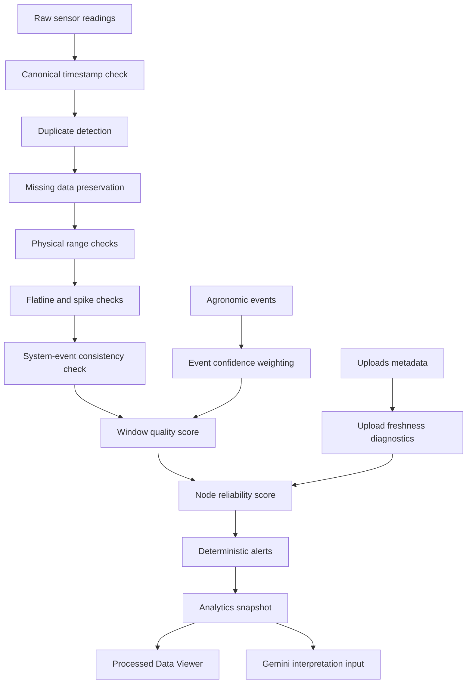

# QC and Reliability Flowchart

## Mermaid diagram

## Interpretation

The QC and reliability pipeline is deterministic. It must run before any interpretation layer. Gemini may receive only processed summaries, reliability scores, limitations, and alert context. It must not clean raw data, fill missing values, compute primary metrics, or override deterministic alert severity.
